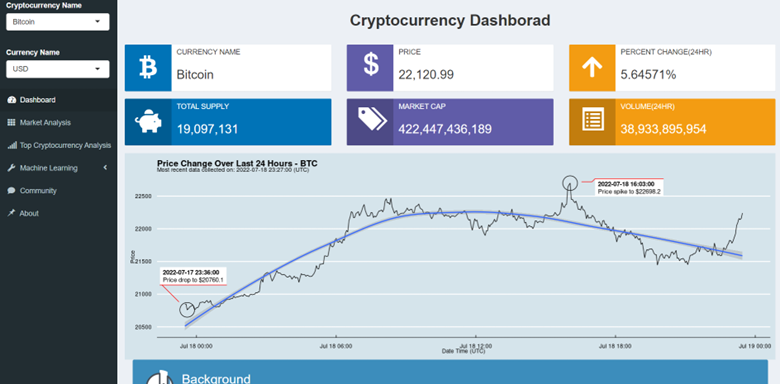
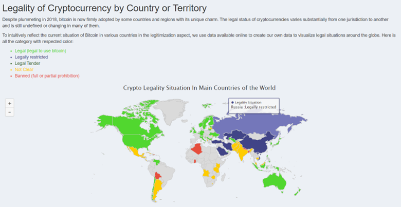
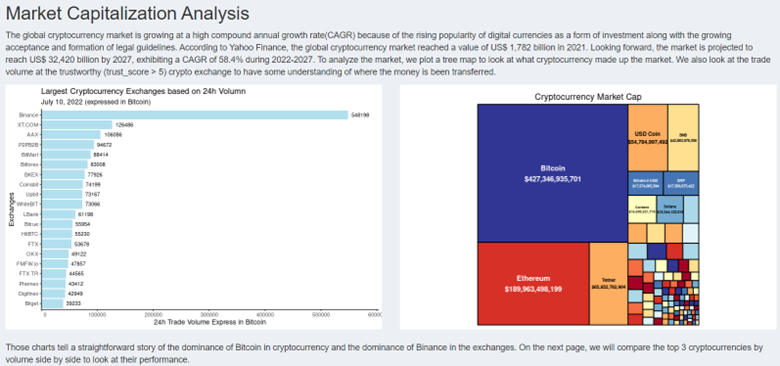
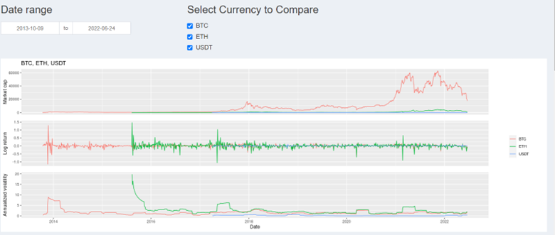
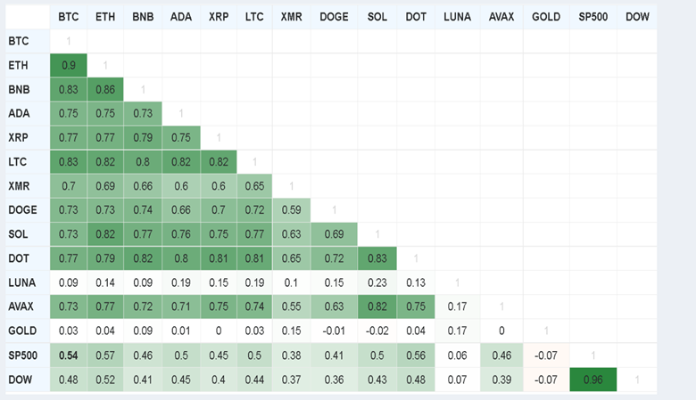
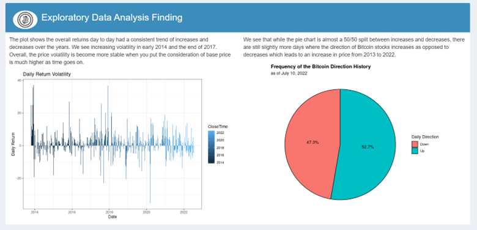
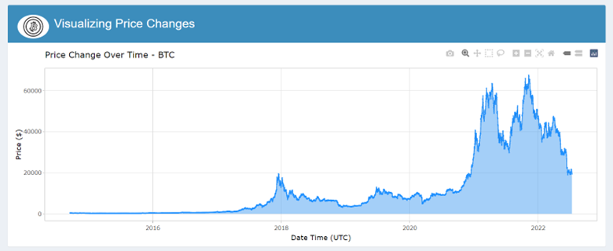
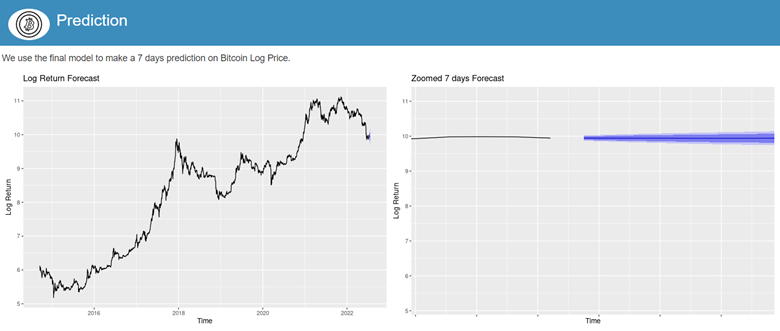
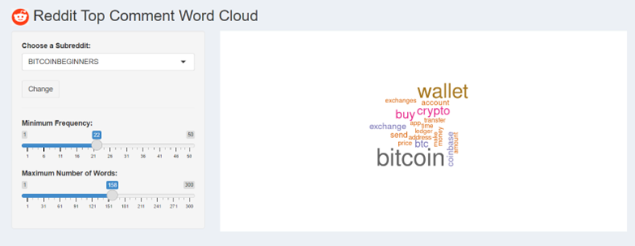
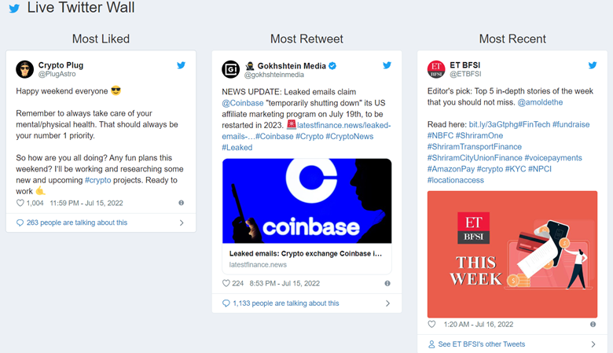

# DataVis_Final_Project
# About
With the recent heat in cryptocurrency many people start to consider it as a real investment opportunity. I create this project to analyze the cryptocurrency market and help other to understand what is the heat about.

## Table of Contents
* Crypto Dashboard and Intro
* Market Analysis
* Top 3 Crypto Analysis
* Machine Learning
* Community
* About

## Data Source:

I use multiple API to obtain the newest data of a variety of cryptocurrencies. I also utilized Reddit API to scrape community discussion in three different subreddit. Here is the API I used:
* [CoinMarketCap](https://coinmarketcap.com/api/)
* [Cryptowatch](https://docs.cryptowat.ch/rest-api)
* [Reddit](https://www.reddit.com/dev/api/)
* [CoinGecko](https://www.coingecko.com/en/api)
* [Twitter](https://developer.twitter.com/en/docs/tutorials/getting-started-with-r-and-v2-of-the-twitter-api)

## Crypto For Everyone

Currently, the application includes the following tabs and features:

- &#x1F4C8; **Cryptocurrency Dashboard** 

    We hope this cryptocurrency website can be helpful to cryptocurrency investors. The cryptocurrency dashboard shows the price, percent change, total supply, market cap, and volume of different types of cryptocurrencies (e.g. Bitcoin, Dogecoin) with various currencies (e.g. USD, CNY). In addition, the background of cryptocurrency is provided. In general, a cryptocurrency is a digital currency that is secured by cryptography. As time goes by, cryptocurrency becomes more and more popular in society. Moreover, we list some research questions about cryptocurrencies and several methodologies to measure the performance of cryptocurrencies.
    
- &#x1F3C6; **Market Analysis** 

    The legal situations in different countries are different and they can be divided into five categories (Legal, Legally restricted, Legal Tender, Not Clear, Banned). When you put the mouse in specific countries on the interactive map, you can see the applied legal policy in each country.

    

    From the market capitalization analysis, we find that Binance is the biggest cryptocurrency exchange and Bitcoin occupies the largest market cap in the cryptocurrency market.

    

- &#x1F3B0; **Top 3 Crypto Analysis** 

    We created the charts to compare 3 top cryptocurrencies including Bitcoin (BTC) and Ethereum (ETH), and Tether (USDT). You choose the date range and the specific cryptocurrencies among these three types of cryptocurrencies.

    

    Also, we designed a correlation table to compare the correlation between cryptocurrencies and other assets. We can see that cryptocurrencies have a positive correlation with other cryptocurrencies.

    

- &#x1F50D; **Machine Learning** 

* Classification
    The data of Bitcoin such as the open price is helpful for audiences to find the past performance of Bitcoin. The price change chart is clear to show the past price varying situation.

    

    Besides, we created the chart to show the daily return volatility and a pie chart to show the Bitcoin changing direction frequency. Moreover, we used 5 algorithms to finish the classification prediction (daily change direction: up or down) and we found that KNN is the best approach.

    

* Prediction
	We used the ARIMA model which is belonging to the LSTM model to predict the future value of Bitcoin. However, we know that the value of Bitcoin is very difficult to predict. The forecasting value of Bitcoin is only a reference, not an accurate prediction.

	

- &#x1F4F8; **Community** 

    From the Reddit word cloud, it is very clear to see the popular keywords of cryptocurrency. Additionally, in the Live Twitter Wall, you can see the most liked tweet, most retweeted tweet, and most recent tweet about cryptocurrency. 

    

    
    
 
    
## &#x1F64F; Thank you!

This application was built using many great tools in the R ecosystem. Thanks to all of the developers of these open source packages:

* shiny
* shinydashboard
* shinydashboardPlus
* ggthemes
* ggforce
* plotly
* tidyverse
* DT
* lubridate
* tm
* wordcloud
* memoise
* reshape2
* gtable
* grid
* gridExtra
* rgdal
* rworldmap
* highcharter
* forecast
* twitterwidget

I would also like to express my gratitude to Dr. Mohammad Ali Alamdar Yazdi for all the help and suggest.

---

This dashboard was built by [Garrick Aden-Buie][garrick-home] and is released under an [MIT license][mit-license].

You are welcome to re-use and/or customize this dashboard! If you do, I kindly request that you provide credit and link back to the [source repo][repo] or my [personal webpage][garrick-home]. Thank you!

[mit-license]: https://choosealicense.com/licenses/mit/
[garrick-home]: https://www.garrickadenbuie.com
[repo]: https://github.com/Zhuojuewang/DataVis_Final_Project